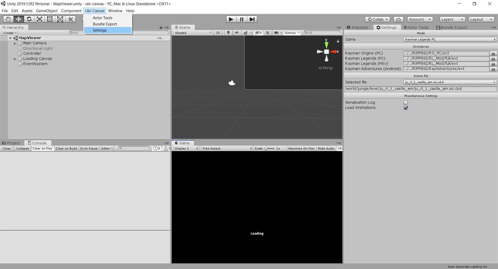

# ubi-canvas Δ
ubi-canvas is a level viewer and editor for UbiArt games such as Rayman Legends and Rayman Adventures.

The main repository is private at this time, as it contains work in progress code for the [Rayman Legends Fan DLC](https://youtu.be/-9cKtxOGoz0).
This Δ version was created as a temporary place to host all non-DLC code for ubi-canvas. When the DLC is released, the main repository will become public again and this repository will be archived. All changes made here will then be merged back into the main repository.

## Important message
Ubi-Canvas supports converting between game modes only because it was implemented specifically for the Fan DLC. We're still working hard on it, so please be patient! It hurts a lot to see people using this incomplete code to implement half-baked conversion tools. Please respect this and wait for the full release instead.

## Contributors
- @byvar: Reverse engineering, main developer
- @RayCarrot: Game Tools, Settings and Serializer windows, various other additions and improvements

## Current status
- Rayman Legends (PC): viewing & editing
- Rayman Adventures (Android), Rayman Mini (MacOS): viewing
- Rayman Legends (PS Vita): limited viewing
- Rayman Origins (PC), Rayman Jungle Run (Android & iOS), Rayman Fiesta Run (Android & iOS): very limited viewing
- Child of Light (PC): very limited viewing

## How to use
1. Download and install Unity 2022.3.7
2. Clone this project and open it with Unity
3. In Unity, open the MapViewer scene (located in Assets/Scenes/).
4. Open the Ubi-Canvas settings window (located under Ubi-Canvas in the toolbar)

5. Set the paths to the extracted game folders. These folders should at least contain the following subfolders:
   - For Rayman Origins: An `itf_cooked` directory and a `localisation` directory containing `localisation.loc`.
   - For Rayman Legends and later games: A `cache` directory and an `enginedata` directory containing `localisation/localisation.loc8`.
6. Select a scene file (you might have to wait for the dropdown to appear while the data directory is searched for scene files)
7. Optionally, more options can be set here. If you want to load animations, check the relevant checkbox, otherwise uncheck it. Since loading is slow, there will be a major speed boost if you uncheck it.
8. In the Game View tab, make sure "Maximize on Play" is unchecked (you will want to see the hierarchy and inspector).
9. Click the play button and wait for it to load.
10. Have fun!

Video tutorial by Lapislalipek:

PBK Editing video tutorial by byvar:

## Controls
- Game view: Shift to toggle camera controls, and WASD to move around after that. Press L to toggle lighting on/off, and G for gizmos.
- Scene view: Hold the right mouse button and use WASD to move around

## Source Code Documentation
Some general documentation can be found on the [Wiki](https://github.com/byvar/ubi-canvas-delta/wiki).

## Misc tips
- I have not checked every scene. If there is an error, please let me know and I will do my best to fix it ASAP.
- Sometimes, you won't see anything in game view or things will be obscured. Press L to disable and enable lighting.
- To play different animations, navigate to the actor in the hierarchy and if it has animations, there will be a "skeleton" object under it. Select it and use the relevant controls in the inspector to select a different animation.
- To add an actor from an *.act file to the scene:
  1. While the scene is loaded, go to the Actor Tools window (located under Ubi-Canvas in the toolbar).
  2. Select an actor file (you might have to wait while the data directory is searched for actor files).
  3. In the hierarchy, make sure to select the Scene object that you want to add the actor to - otherwise, the main scene is used.
  4. Click the Load button.
- To export any actor to an *.act file:
  1. While the scene is loaded, go to the Actor Tools window (located under Ubi-Canvas in the toolbar).
  2. Under Export Actor, browse and save the file anywhere. To facilitate loading it afterwards, it is recommended to save it under `cache/itf_cooked/pc`.
  3. Click the Export button.
- To write a patch IPK file (this only works on Rayman Legends for now):
  1. While the scene is loaded, go to the Bundle Export window (located under Ubi-Canvas in the toolbar).
  2. Make sure "bundle file" is filled in by browsing and saving the file anywhere.
  2. Select all the files you have edited and want to store in the patch bundle.
  3. Click the Write button. When it's ready, put it in the game folder as `patch_PC.ipk` and test your edits in-game!
